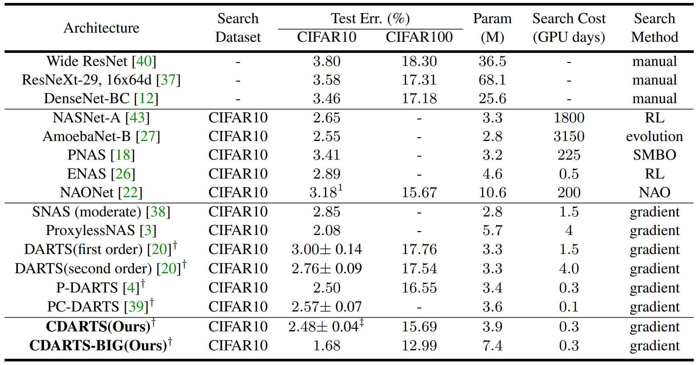

# Cyclic Differentiable Architecture Search: A Unified Architecture for Integrating Search and Evaluation Networks

<div align="center">
  
  <!-- <p>framework1.</p> -->
</div>

## Features of CDARTS
- :star2: We provided all information (training and test code, random seeds, documentation) needed to exactly reproduce the results.
- :star2: We achieved the best or comparable performance on CIFAR10(97.60%), CIFAR100(84.31%) and ImageNet (76.6%) under the DARTS searching space!
- :star2: Our big model achieved impressive performance on CIFAR10(98.32%), CIFAR100(87.01%) and ImageNet (81.1%)!
- :star2: Our code support distributed training.

## [Results updated!](https://github.com/cvpr-2020/cdarts)
<div align="center">
  
  <!-- <p>cell.</p> -->
</div>

<div align="center">
  
  <!-- <p>results1.</p> -->
</div>

<div align="center">
  
  <!-- <p>results1.</p> -->
</div>

## Environments
Tesla V100, CUDA10.0, linux 16.04, pytorch>=1.2, python3, [apex](https://github.com/NVIDIA/apex)

## Data Preparation
* [Cifar-10](https://www.cs.toronto.edu/~kriz/cifar.html)
* [Cifar-100](https://www.cs.toronto.edu/~kriz/cifar.html)
* [ImageNet-2012](http://www.image-net.org/)

Create soft link in main dir.
```
ln -s $DataLocation data
```

## Installation
* First, you should install graphviz.
     ```
     sudo apt-get install graphviz
     ```
* Then install python requirements.
    ```buildoutcfg
    pip install graphviz
    pip install torch==1.2.0
    pip install tensorboard==1.13.0
    pip install tensorboardX==1.6
    ```
* You should install apex.
    ```buildoutcfg
    git clone https://github.com/NVIDIA/apex
    cd apex
    python setup.py install --cpp_ext --cuda_ext
    ```

## Search, Retrain and Test
We have provided all the shell scripts and the corresponding default parameters, which are stored in the scripts folder. You should copy them to the main directory first and then run them. 
* For example:
    ```buildoutcfg
    cd ${ROOT}
    copy scripts/run_search_cifar_1gpu.sh .
    copy scripts/run_retrain_cifar_1gpu.sh .
    bash run_search_cifar_1gpu.sh
    bash run_retrain_cifar_1gpu.sh
    ```

### Search
* Main python file is ${ROOT}/search.py
* Followings are options during training.
    ```buildoutcfg
    --regular                   # whether to use regular
    --regular_ratio             # if use regular, the ragular ratio
    --regular_coeff             # if use regular, the regular coefficient
    --ensemble_param            # Ensemble different layer features
    --loss_alpha                # the loss coefficient
    --w_lr                      # the learning rate of the search network
    --alpha_lr                  # the learning rate of the architecture parameters
    --nasnet_lr                 # the learning rate of the evaluation network
    --w_weight_decay            # the weight decay the search and the evaluation network
    --alpha_weight_decay        # the weight decay the the architecture parameters
    --fix_head                  # wheter to fix the paramters of auxiliary heads
    --interactive_type          # The KD function, 0 kl, 1 cosine, 2 mse, 3 sl1
    --pretrain_epochs           # the pretrain epochs of the search network
    --search_iter               # the search iterations
    --search_iter_epochs        # the epochs in each search iteration
    --nasnet_warmup             # the epochs used to train a new evaluation network
    ```
* Here we present our search scripts on CIFAR and ImageNet.
    ```buildoutcfg
    bash run_search_cifar_1gpu.sh
    bash run_search_imagenet.sh
    ```
* Modify the following settings in `run_search_cifar_1gpu.sh` to search on CIFAR100.
    ```
    --dataset cifar100
    --n_classes 100
    ```

### Retrain
* Main python file is ${ROOT}/augment.py
* Followings are options during training.
    ```buildoutcfg
    --cell_file                 # path of cell genotype
    --weight_decay              # decay of W in the Retrain-Phase
    --lr                        # learning rate of W in the Retrain-Phase
    --warmup_epochs             # warmup epochs 
    --epochs                    # total retrain epochs 
    --cutout_length             # cutout length for cifar
    --aux_weight                # weight of auxiliary loss, 0.4 is the best option   
    --drop_path_prob            # used for dropping path in NAS
    --label_smooth              # label smooth ratio
    ```
* Here we present our train scripts on CIFAR and ImageNet.
    ```buildoutcfg
    bash run_retrain_cifar_1gpu.sh
    bash run_retrain_imagenet.sh
    ```
* Modify the following settings in `run_retrain_cifar.sh` to train CIFAR100.
    ```
    --dataset cifar100
    --n_classes 100
    ```

### Test
* Main python file is ${ROOT}/test.py
* Followings are options during testing.
    ```buildoutcfg
    --resume                   # whether to load checkpint
    --resume_name              # checkpint name
    ```
* Here we present our test scripts on CIFAR and ImageNet.
    ```buildoutcfg
    bash run_test_cifar.sh
    bash run_test_imagenet.sh
    ```
* Modify the following settings in `run_test_cifar.sh` to test CIFAR100.
    ```
    --dataset cifar100
    --n_classes 100
    ```
